# AI-Based Abnormal Behavior Detection from Surveillance Cameras

This repository contains the packaged deliverables for the FPT University capstone **"AI-Based Abnormal Behavior Detection from Surveillance Cameras"**. The project focuses on building a practical AI surveillance pipeline that can automatically detect three high-risk events in CCTV video:

- `Fire`
- `Fall`
- `Fighting`

The system is described in detail in the project report `AI_Based_Abnormal_Behavior_Detection_from_Surveillance.pdf`, and the deliverables are distributed mainly as root-level `.zip` packages. This README is written from that report and is intended to be detailed enough for GitHub readers, evaluators, and collaborators who want to understand both the research direction and the packaged project artifacts.

## Executive summary

Modern surveillance systems generate a large amount of video, but manual monitoring is expensive, tiring, and easy to miss important events. This capstone proposes a hybrid AI pipeline that combines fast detection with deeper spatio-temporal reasoning:

- `YOLOv11` is used as the front-end trigger to scan frames quickly.
- `YOLOv11 Pose + SlowFast` is used to analyze human behavior over short clips.
- `YOLOv11 + MobileNetV3-Small` is used to detect and verify fire events.
- A `Flask` dashboard is used to present alerts, processed video, and timeline-style outputs.

The overall goal is not just to classify short clips in isolation, but to create a deployable abnormal-event detection workflow that is practical for real surveillance usage on a single `NVIDIA RTX 3060` workstation.

## Problem statement

The report frames three major surveillance challenges:

1. Human operators cannot reliably watch many cameras at the same time for long periods.
2. Dangerous events such as falls, fights, and fire are rare but important, so missing even a small number of cases is costly.
3. Full-video deep analysis is expensive, so a realistic system needs a fast filtering mechanism before sending data to heavier models.

To address this, the project uses a staged architecture where a fast detector identifies potentially relevant frames first, and deeper models are activated only when needed.

## Project objectives

According to the capstone report, the main objectives are:

- Detect `Fire`, `Fall`, and `Fighting` in untrimmed surveillance videos.
- Build a hybrid architecture that combines detection, pose, clip classification, and alert generation.
- Improve robustness against visually confusing cases such as red clothes or bright lights being mistaken for fire.
- Support practical deployment through a Flask dashboard and packaged checkpoints.
- Achieve near real-time inference on consumer-grade GPU hardware.

## System architecture

The proposed solution is a two-branch hybrid architecture. One branch focuses on human behavior analysis, while the other focuses on environmental hazard monitoring.

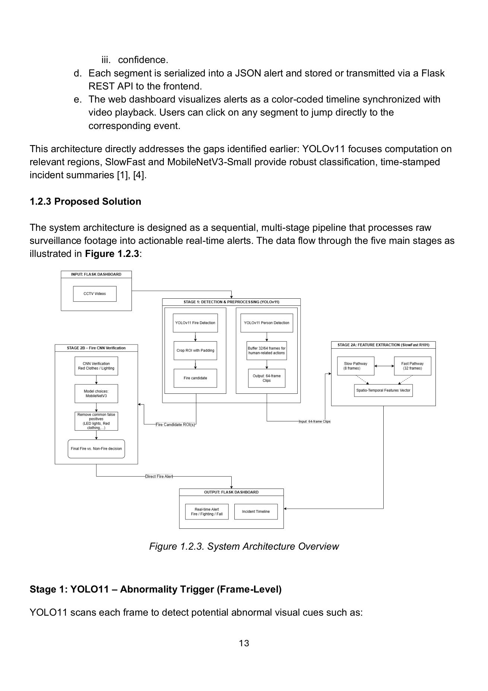

### Branch 1: Human behavior analysis

This branch is responsible for distinguishing human actions such as `normal`, `fall`, and `fighting`.

Pipeline idea:

- `YOLOv11` detects people and identifies frames that are likely to be meaningful.
- `YOLOv11 Pose` extracts 17 keypoints for detected people.
- Short person-centered clips are sent into a `SlowFast R101 + Pose Encoder` model.
- Temporal smoothing and alert logic are used to stabilize predictions before visualization.

Why this matters:

- Falls and fights are temporal events, not just single-frame appearance problems.
- Pose-guided cropping helps the action model focus on body motion instead of background clutter.
- The SlowFast design captures both semantic structure and rapid motion.

### Branch 2: Fire monitoring

This branch handles fire detection and verification.

Pipeline idea:

- `YOLOv11` first localizes candidate fire regions.
- Cropped fire ROIs are passed into `MobileNetV3-Small`.
- The CNN verifies whether the candidate really contains fire or is a visually similar non-fire object.

Why this matters:

- A detector alone can be biased by color and brightness.
- The verification stage helps reduce false alarms caused by red shirts, reflections, or bright lights.
- This makes the fire branch more reliable for practical alerting.

## Figures from the report

The following figures are rendered directly from the PDF report and included here to make the README self-contained.

### Data preparation and modeling figures

**Sample data with pose/detection preparation**

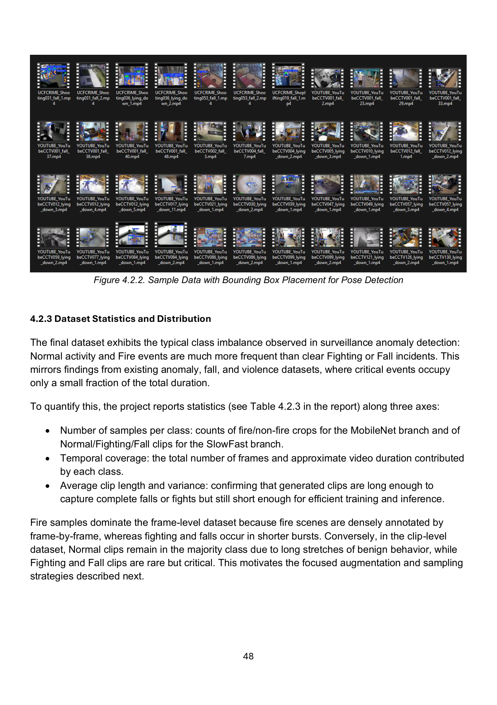

**Frames and sequence analysis used for clip construction**

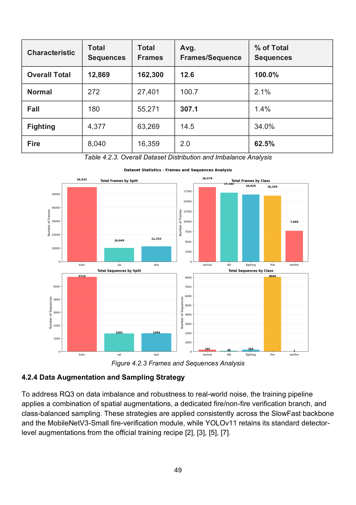

**Dual-pathway SlowFast mechanism**

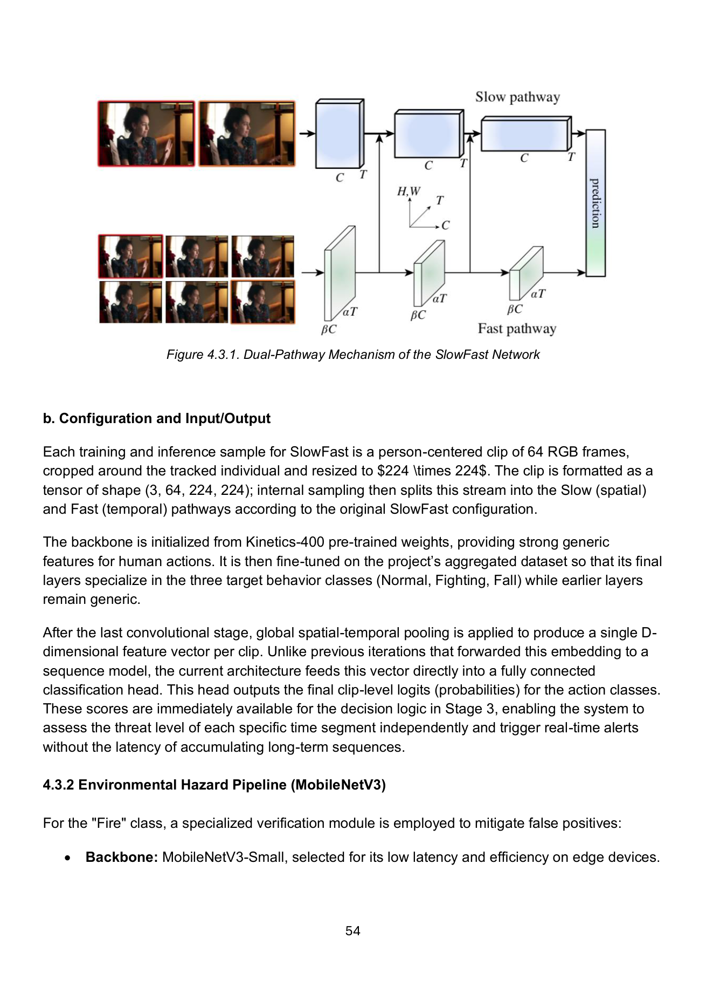

**Modified MobileNetV3-Small head for fire verification**

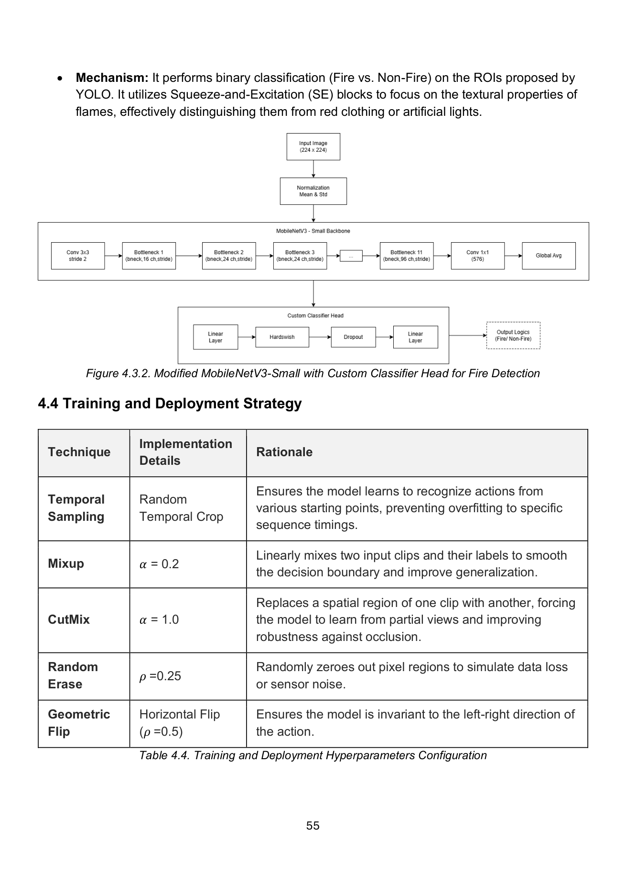

These figures show how the project bridges raw video into model-ready inputs and why different model families are used for different event types.

## Root package structure

This project is currently organized primarily around packaged deliverables in the root directory. The key files are:

| File | Purpose |
|---|---|
| `AI_Based_Abnormal_Behavior_Detection_from_Surveillance.pdf` | Full capstone report with methodology, experiments, results, limitations, and references |
| `CodeApp.zip` | Deployable Flask application, runtime pipeline, static assets, templates, checkpoints, and test videos |
| `CodeTrain.zip` | Training notebooks, training outputs, logs, result plots, and saved experiment artifacts |
| `checkpointsmodel.zip` | Packaged trained model weights for deployment |
| `LinkDataSet.zip` | Dataset reference package; contains `dataset.docx` with dataset information/link |
| `final full bundle zip (*FULL.zip)` | All-in-one bundled submission package containing the core deliverables above |
| `LinkCode&Dataset.txt` | Direct shared link used for project and dataset distribution |

### What is inside each main zip

#### `CodeApp.zip`

The application package includes the runnable web app and the deployment-side model files. Key contents include:

- `CodeApp/app/app.py`
- `CodeApp/app/detect_track_action.py`
- `CodeApp/app/requirements.txt`
- `CodeApp/app/templates/dashboard.html`
- `CodeApp/app/static/`
- `CodeApp/app/checkpoints/`
- `CodeApp/app/test_videos/`
- `CodeApp/app/yolo11m-pose.pt`

This package is the main runtime deliverable.

#### `CodeTrain.zip`

The training package contains the experiment notebooks and saved outputs for each model branch:

- `TrainSlowFast/`
- `TrainYolo11PoseDetection/`
- `TrainYolo11FireDetection/`
- `TrainCNNVerification/`

Examples of included artifacts:

- `SlowFast_Pose_Retrain.ipynb`
- `Train_Fire_YOLOv11.ipynb`
- `train_yolov11.ipynb`
- `Fire_CNN_Classifier.ipynb`
- training logs, confusion matrices, `results.csv`, and exported plots

This package is the main research and reproducibility deliverable.

#### `checkpointsmodel.zip`

The checkpoint package contains the trained deployment weights:

- `best_model_pose.pth`
- `customyolov11m.pt`
- `best_model_fire.pt`
- `fire_red_cnn.pth`

These are the key models needed to run the packaged application.

#### `final full bundle zip (*FULL.zip)`

This is the full bundled submission package. It contains:

- `checkpointsmodel.zip`
- `CodeApp.zip`
- `CodeTrain.zip`
- `Slide_Presentation.pdf`
- `LinkDataSet.zip`
- `Present_Order.pdf`
- `AI_Based_Abnormal_Behavior_Detection_from_Surveillance.pdf`

This file is the easiest way to preserve the entire capstone handoff in a single archive.

## Experimental setup from the report

The report describes the experimental environment as follows:

- Hardware: `NVIDIA RTX 3060` with `12 GB VRAM`
- Framework stack: `PyTorch`, `CUDA`, `cuDNN`
- Optimization support: `Automatic Mixed Precision (AMP)`
- Deployment target: a Flask-based dashboard running on the same practical workstation class

### Data split strategy

The project uses approximately:

- `70%` training
- `15%` validation
- `15%` test

The split is performed at the original video level to avoid leakage between train/validation/test subsets.

### Human branch training details

From the report, the SlowFast action branch uses:

- `64-frame` RGB clips
- input resolution around `224 x 224`
- `AdamW` optimizer
- cosine annealing warm restarts
- gradient accumulation because of VRAM limits
- up to `20 epochs` with early stopping
- online augmentations such as horizontal flip, random erase, Mixup, and CutMix

### Fire branch training details

The fire branch uses a two-stage process:

1. `YOLOv11` for fire object detection and localization.
2. `MobileNetV3-Small` for binary fire/non-fire verification.

The report emphasizes that this separation is important because a direct detector can still confuse fire with visually similar non-fire objects.

## Quantitative results

The report presents strong overall results for the full project:

- Overall test accuracy: `93.66%`
- Macro F1-score: `89.41%`
- Human branch best validation accuracy: `78.26%`
- Human branch best validation F1-score: `0.73`
- Fire branch mAP@50: `0.8071`
- Fire CNN validation accuracy: `99.93%`
- Fire CNN loss stabilized near `0.0031`

### Human branch training convergence

**Binary cross-entropy loss across training**

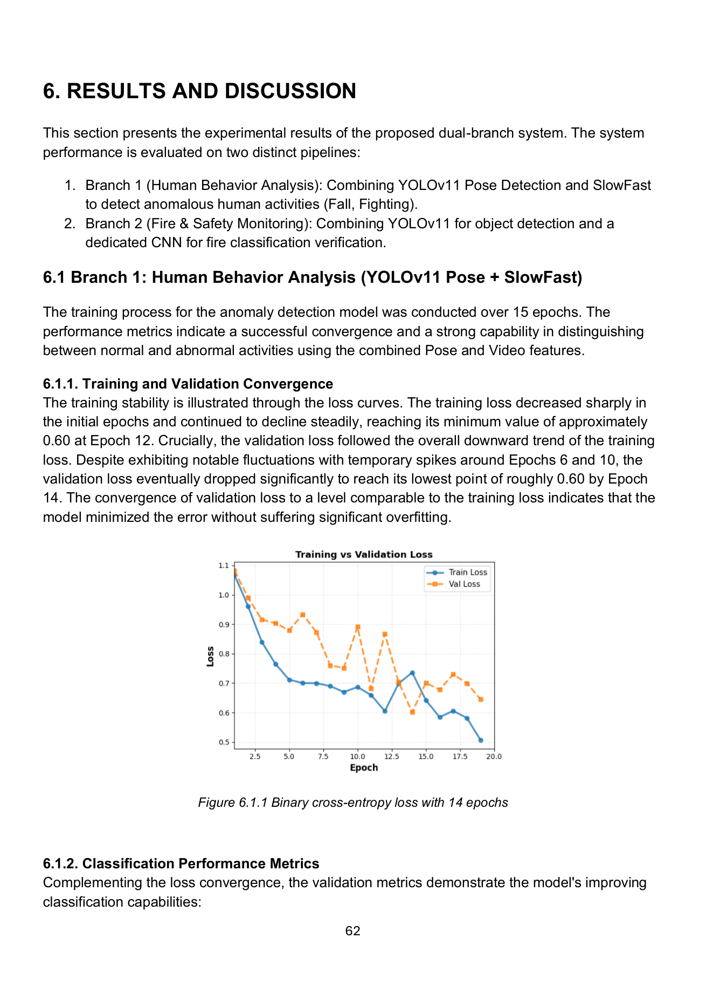

**Validation accuracy and F1 behavior**

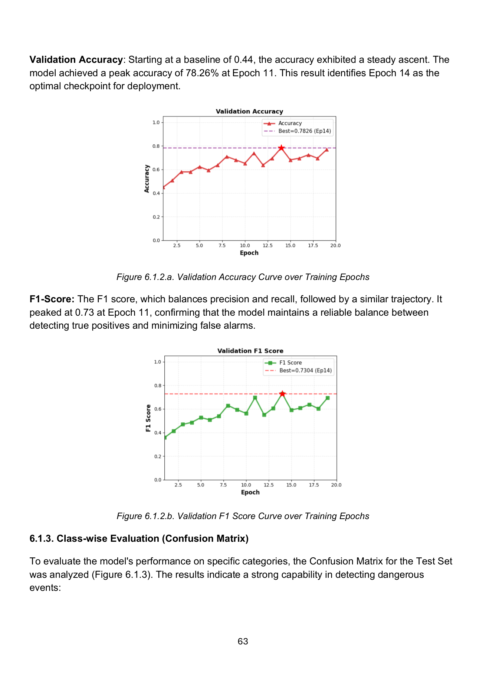

The report notes that the human-action model converged well and reached its best checkpoint in the later training stage. Validation loss remained close to training loss, suggesting that overfitting was controlled reasonably well.

### Human branch confusion matrix

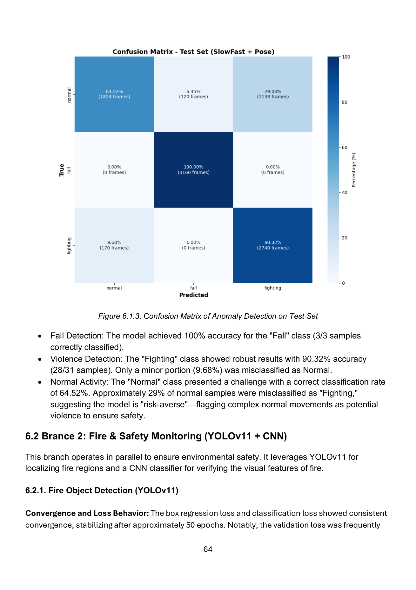

Important observations from the report:

- `Fall` detection reached `100%` class accuracy on the reported test samples.
- `Fighting` reached `90.32%` accuracy.
- `Normal` was the hardest class, with many active normal movements being confused as fighting.

This behavior is discussed in the report as a safety-biased tendency: the model is more willing to over-warn than to ignore a possibly dangerous event.

### Fire branch detection and verification results

**YOLOv11 fire detection branch**

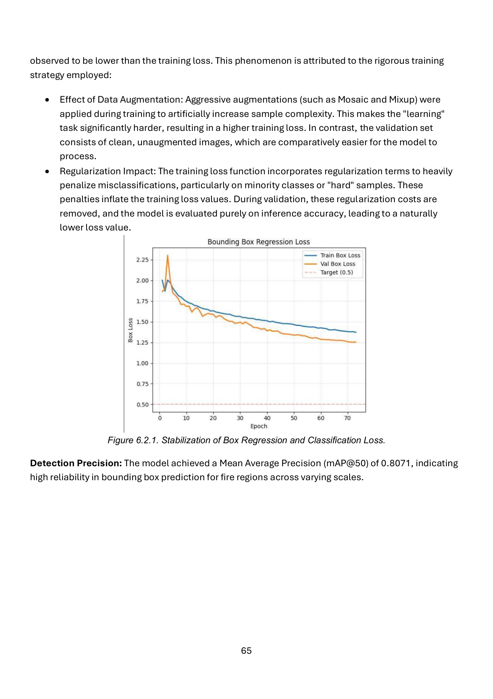

**CNN training curves for fire verification**

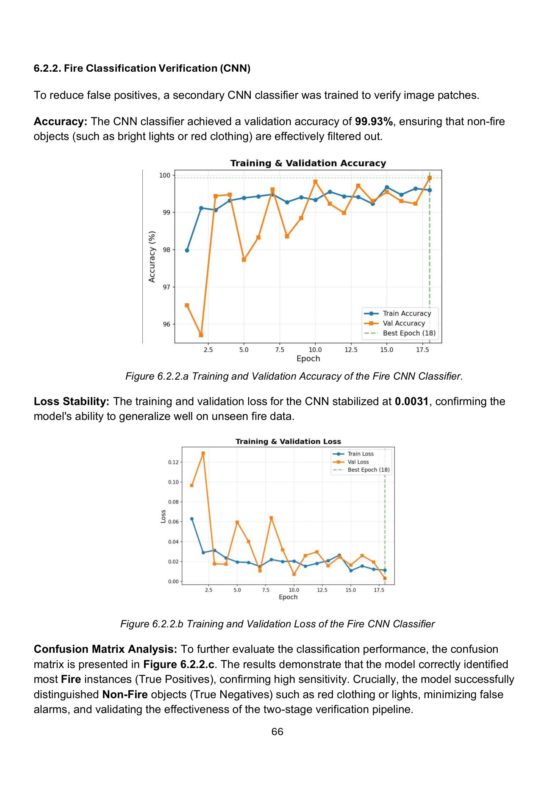

**Fire vs non-fire confusion matrix**

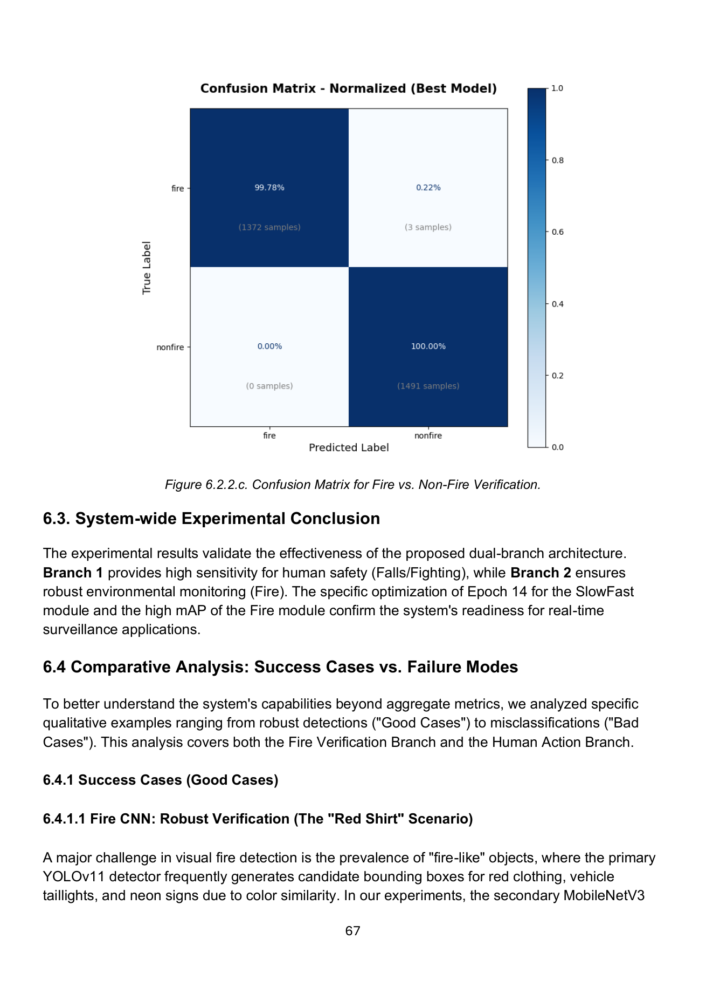

The report shows that the fire branch is one of the strongest parts of the system:

- YOLOv11 achieved a strong detection score for fire localization.
- The MobileNetV3 verification module helped filter misleading candidates.
- The combined pipeline achieved extremely high fire/non-fire discrimination quality.

## Success cases discussed in the report

The report includes qualitative examples where the architecture works especially well.

### Fire verification success case

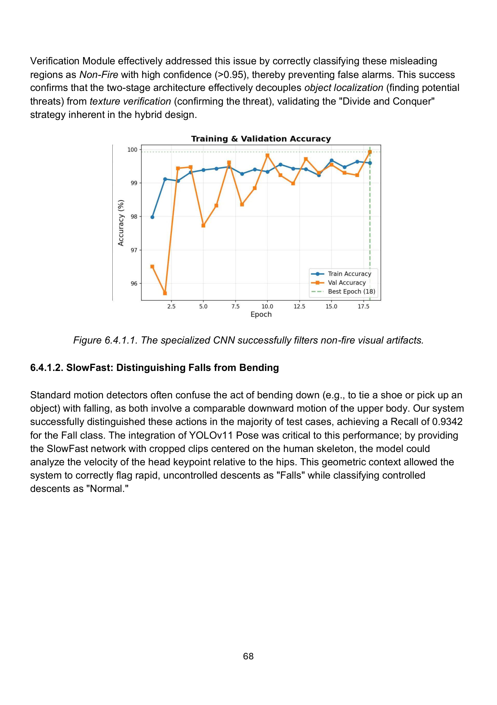

This figure highlights one of the most important contributions of the system: reducing false alarms on fire-like objects. The verification CNN can reject non-fire objects that share similar color characteristics with flames.

### SlowFast success case

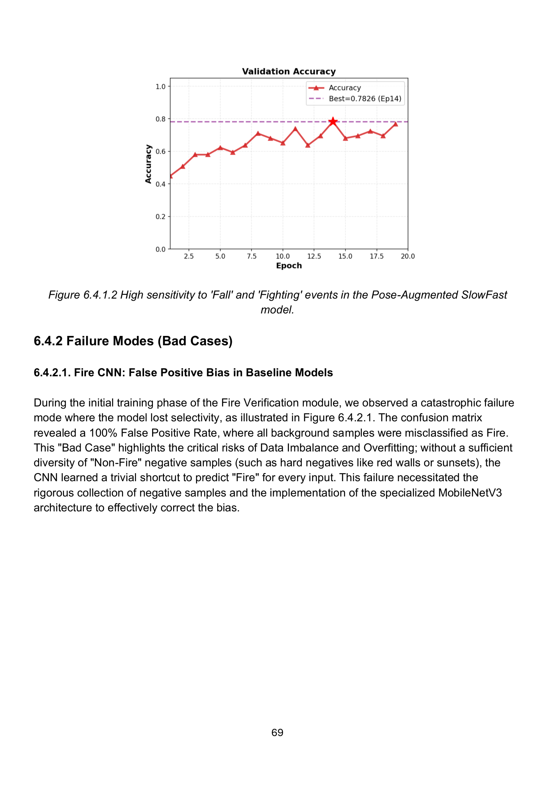

This example shows the system's ability to distinguish a real fall from a controlled bending motion. According to the report, pose-guided clip construction is an important reason this works better than a naive motion detector.

## Failure modes discussed in the report

The report also explicitly documents failure cases, which is useful for honest evaluation.

### Fire CNN failure mode in early baseline behavior

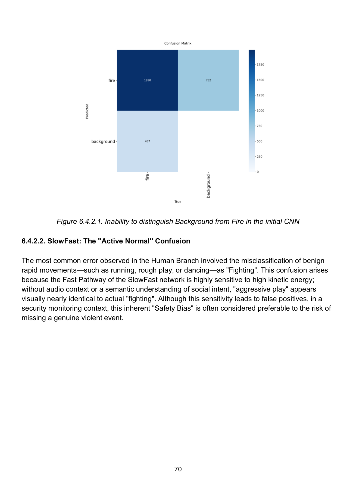

An early failure mode showed that if negative samples are not diverse enough, the model can collapse into predicting fire too aggressively. This is why hard non-fire examples are important during training.

### SlowFast active-normal confusion

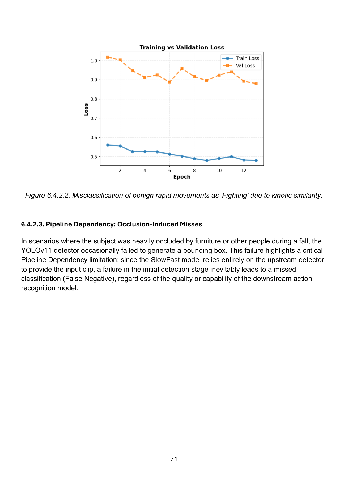

Fast normal actions such as rough play, running, or dancing may be misclassified as fighting because they share strong motion energy patterns.

### Occlusion-induced miss

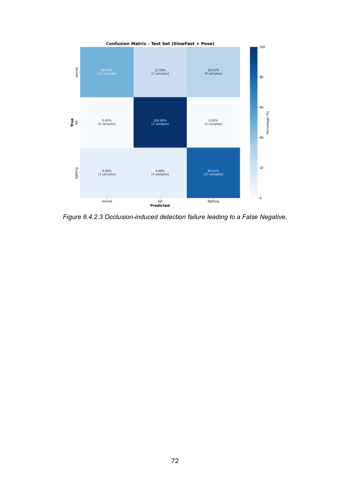

This is a pipeline dependency issue: if the front-end detector misses the person because of heavy occlusion, the downstream action classifier never receives a useful clip.

## How to run the packaged application

If you want to run the project from the packaged deliverables:

### 1. Extract the required archives

At minimum, extract:

- `CodeApp.zip`
- `checkpointsmodel.zip`

If you want the full research/training side as well, also extract:

- `CodeTrain.zip`

### 2. Go to the application folder

```bash
cd CodeApp/app
```

### 3. Create a virtual environment

```bash
python -m venv .venv
```

### 4. Activate the environment on Windows

```bash
.venv\Scripts\activate
```

### 5. Install dependencies

```bash
pip install -r requirements.txt
```

Main libraries inside the app package include:

- `Flask`
- `Flask-CORS`
- `torch`
- `torchvision`
- `ultralytics`
- `opencv-python`
- `imageio`
- `pytorchvideo`

### 6. Make sure checkpoints are available

The application expects these model files:

- `best_model_pose.pth`
- `customyolov11m.pt`
- `best_model_fire.pt`
- `fire_red_cnn.pth`

These are already packaged in the deliverables.

### 7. Run the dashboard

```bash
python app.py
```

### 8. Open the local interface

```text
http://localhost:5000
```

## Current deliverable status

From the release-package perspective, this project already includes:

- The full written capstone report
- The runnable application package
- The model checkpoints package
- The training notebooks and experiment outputs
- The full bundled final submission archive

That makes the repository suitable not only as a code dump, but also as a documented academic-project handoff.

## Limitations

The report clearly acknowledges several limitations:

- The pipeline depends heavily on the front-end detector.
- Heavy occlusion, unusual viewpoints, and poor lighting still reduce reliability.
- Action recognition remains sensitive to visually similar high-motion activities.
- The system is practical, but not yet a fully polished commercial surveillance product.

## Future work

The report proposes several next steps:

- Edge optimization and quantization for lighter deployment
- RTSP/IP camera integration for continuous live monitoring
- Multimodal fusion, especially audio cues, to improve confidence and reduce ambiguity
- More robust handling of long-form temporal localization and difficult edge cases

## Reference

Primary source for this README:

- `AI_Based_Abnormal_Behavior_Detection_from_Surveillance.pdf`

Core packaged deliverables referenced here:

- `CodeApp.zip`
- `CodeTrain.zip`
- `checkpointsmodel.zip`
- `LinkDataSet.zip`
- `final full bundle zip (*FULL.zip)`

