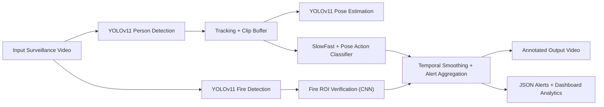

# AI-Based Abnormal Behavior Detection from Surveillance Cameras

> FA25 Capstone Project  
> Real-time abnormal event detection for surveillance video using YOLOv11, SlowFast + Pose, and a Flask dashboard.


## Overview

This project builds an end-to-end AI surveillance system for detecting abnormal events from uploaded video streams.  
The deployed application combines object detection, pose estimation, temporal action recognition, and fire verification into a single dashboard-oriented workflow.

The current system focuses on three main abnormal-event categories:

- `Fall`
- `Fighting`
- `Fire`

The application accepts a surveillance video, processes it frame by frame, produces an annotated output video, and exports alert logs in JSON format for later review.

The full academic report is available here: [AI_Based_Abnormal_Behavior_Detection_from_Surveillance.pdf](AI_Based_Abnormal_Behavior_Detection_from_Surveillance.pdf)

## Key Features

- Flask-based dashboard for video upload, processing status, statistics, and alert review
- YOLOv11-based person detection and dedicated fire detection
- YOLOv11 pose estimation for extracting human keypoints
- SlowFast + Pose fusion model for abnormal human-action recognition
- Optional MobileNetV3-based fire verification branch to reduce false positives
- Output video rendering with bounding boxes, labels, and confidence scores
- Alert export to `static/outputs/alerts_*.json`
- Support for `mp4`, `avi`, `mov`, `mkv`, `flv`, and `wmv`

## Demo

| Fall Detection | Fire Detection | Fighting Detection |
|---|---|---|
|  |  |  |

## System Architecture



### Runtime pipeline

1. Detect people and fire regions from each frame.
2. Track person instances over time.
3. Extract human pose keypoints for tracked people.
4. Build temporal clips and classify actions with the SlowFast + Pose branch.
5. Verify suspicious fire regions with the CNN branch when available.
6. Apply temporal smoothing and persistence logic.
7. Save the annotated video and generated alerts for dashboard visualization.

## Model Components

| Component | Role | Expected File |
|---|---|---|
| YOLOv11 custom detector | Person / abnormal object detection | `checkpoints/customyolov11m.pt` |
| YOLOv11 pose model | Human keypoint extraction | `yolo11m-pose.pt` |
| SlowFast + Pose model | `normal / fall / fighting` classification | `checkpoints/best_model_pose.pth` |
| YOLO fire detector | Fire localization | `checkpoints/best_model_fire.pt` |
| MobileNetV3 verifier | Fire / non-fire verification | `checkpoints/fire_red_cnn.pth` |

## Experimental Results

The metrics below were compiled from the training artifacts packaged in `FA25 FULL.zip/CodeTrain.zip` together with the project report.

### 1. Human action branch: SlowFast + Pose

Test classification report:

| Class | Precision | Recall | F1-score | Support |
|---|---|---|---|---|
| Normal | 0.8696 | 0.6452 | 0.7407 | 31 |
| Fall | 0.6000 | 1.0000 | 0.7500 | 3 |
| Fighting | 0.7568 | 0.9032 | 0.8235 | 31 |
| **Overall Accuracy** | - | - | **0.7846** | 65 |
| **Macro Avg** | 0.7421 | 0.8495 | **0.7714** | 65 |
| **Weighted Avg** | 0.8033 | 0.7846 | **0.7807** | 65 |

Best validation results from training summary:

- Best validation F1: `0.7304` at epoch `14`
- Best validation accuracy: `0.7826` at epoch `14`

### 2. Fire detection branch: YOLOv11

Best checkpoint by `mAP@0.5:0.95`:

| Precision | Recall | mAP@0.5 | mAP@0.5:0.95 | Best Epoch |
|---|---|---|---|---|
| 0.8306 | 0.7705 | 0.7990 | 0.5150 | 72 |

### 3. Pose / person detector branch: YOLOv11

Best checkpoint by `mAP@0.5:0.95`:

| Precision | Recall | mAP@0.5 | mAP@0.5:0.95 | Best Epoch |
|---|---|---|---|---|
| 0.7827 | 0.7355 | 0.8211 | 0.6208 | 33 |

## Evaluation Visuals

### SlowFast + Pose training and diagnostics


### YOLOv11 fire and pose training curves


## Dataset and External Resources

The submission package includes a dataset-link document inside `FA25 FULL.zip -> LinkDataSet.zip -> dataset.docx`.  
Those links are reproduced here for convenience:

- SlowFast / action-recognition dataset: [Google Drive folder](https://drive.google.com/drive/folders/1bEaTlm3HRLjEe3Ju_6oeWuJHY5N3MvSD?usp=sharing)
- YOLOv11 pose-detection dataset: [Google Drive folder](https://drive.google.com/drive/folders/16dSY5aajKi90Cv2LzdZrfz4OPVxlJTi8?usp=sharing)
- Fire detection + CNN verification dataset: [Google Drive folder](https://drive.google.com/drive/folders/1YSqLaV_1y6EGQ_xT-Mm16t_lZH322z_W?usp=sharing)

### Weight files

The trained checkpoints exist locally in the submission package and in the ignored `checkpoints/` folder, but large binary weights are not suitable for a normal Git commit.

Recommended publication strategy for GitHub:

- Keep source code in the repository
- Upload model weights through `GitHub Releases`, `Google Drive`, or `Git LFS`
- The current offline backup is stored in `FA25 FULL.zip -> checkpointsmodel.zip`
- Keep the same filenames used by the codebase:
  - `best_model_pose.pth`
  - `best_model_fire.pt`
  - `customyolov11m.pt`
  - `fire_red_cnn.pth`
  - `yolo11m-pose.pt`

## Project Structure

```text
.
|-- app.py
|-- detect_track_action.py
|-- requirements.txt
|-- templates/
|   `-- dashboard.html
|-- static/
|   |-- app.js
|   |-- style.css
|   `-- outputs/
|-- outputs/
|-- uploads/
|-- checkpoints/              # local weights, ignored by git
|-- assets/
|   `-- readme/
|       |-- demo/
|       `-- results/
|-- AI_Based_Abnormal_Behavior_Detection_from_Surveillance.pdf
`-- FA25 FULL.zip
```

## Setup Instructions

### 1. Prerequisites

- Python `3.10`
- Windows or Linux environment
- NVIDIA GPU recommended for practical inference speed
- CUDA-compatible PyTorch installation recommended

### 2. Clone the repository

```bash
git clone <your-repository-url>
cd <your-repository-folder>
```

### 3. Create and activate a virtual environment

```bash
python -m venv .venv
```

Windows PowerShell:

```powershell
.venv\Scripts\Activate.ps1
```

Linux / macOS:

```bash
source .venv/bin/activate
```

### 4. Install dependencies

The project already provides a `requirements.txt` file:

```bash
pip install --upgrade pip
pip install -r requirements.txt
```

Notes:

- The current `requirements.txt` is prepared for a CUDA `11.8` PyTorch installation.
- If you do not use CUDA, replace the first PyTorch lines with CPU-compatible packages before installing.

### 5. Add model weights

Place the following files in the expected locations:

```text
checkpoints/best_model_pose.pth
checkpoints/best_model_fire.pt
checkpoints/customyolov11m.pt
checkpoints/fire_red_cnn.pth
yolo11m-pose.pt
```

### 6. Run the application

```bash
python app.py
```

Then open:

```text
http://127.0.0.1:5000
```

## How to Use

1. Open the dashboard in your browser.
2. Go to the `Upload Video` page.
3. Upload a surveillance video.
4. Wait for background processing to complete.
5. Review:
   - real-time processing preview
   - output annotated video
   - generated alerts
   - statistics and summary charts

## Notes and Limitations

- The current implementation is optimized for research/demo use rather than production deployment.
- The action branch is strongest on `fall` and `fighting`, but highly active normal scenes can still create confusion.
- Occlusion, unusual viewpoints, and crowded scenes may reduce performance.
- Alert logs are currently frame-dense; additional event-level consolidation would improve downstream reporting.
- Large checkpoints such as `best_model_pose.pth` should be distributed externally instead of pushed directly to Git.
- For a clean public GitHub repo, it is better to keep only source code, README assets, and the report, while hosting datasets and checkpoints externally.

## Tech Stack

- `Python`
- `Flask`, `Flask-CORS`
- `PyTorch`, `TorchVision`, `PyTorchVideo`
- `Ultralytics YOLOv11`
- `OpenCV`
- `NumPy`
- `ImageIO / FFmpeg`
- `HTML`, `CSS`, `JavaScript`, `Chart.js`

## Acknowledgment

This repository accompanies the FA25 capstone work on AI-based abnormal behavior detection from surveillance footage, including the engineering implementation, training artifacts, evaluation plots, and project report.
